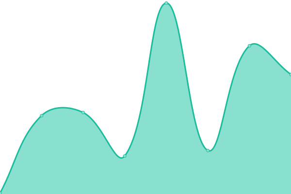

# [📈 Live Status](https://luxtagofficial.github.io/upptime): <!--live status--> **🟩 All systems operational**

This repository contains the open-source uptime monitor and status page for [Upptime](https://upptime.js.org), powered by [Upptime](https://github.com/upptime/upptime).

With [Upptime](https://upptime.js.org), you can get your own unlimited and free uptime monitor and status page, powered entirely by a GitHub repository. We use [Issues](https://github.com/luxtagofficial/upptime/issues) as incident reports, [Actions](https://github.com/luxtagofficial/upptime/actions) as uptime monitors, and [Pages](https://luxtagofficial.github.io/upptime) for the status page.

<!--start: status pages-->
<!-- This summary is generated by Upptime (https://github.com/upptime/upptime) -->
<!-- Do not edit this manually, your changes will be overwritten -->
<!-- prettier-ignore -->
| URL | Status | History | Response Time | Uptime |
| --- | ------ | ------- | ------------- | ------ |
|  [LuxTag.io](https://www.luxtag.io) | 🟩 Up | [lux-tag-io.yml](https://github.com/luxtagofficial/upptime/commits/HEAD/history/lux-tag-io.yml) | 

 115ms
     
 | 

<a href="https://luxtagofficial.github.io/upptime/history/lux-tag-io">100.00%</a>
    

|  [BrandTag.io](https://www.brandtag.io) | 🟩 Up | [brand-tag-io.yml](https://github.com/luxtagofficial/upptime/commits/HEAD/history/brand-tag-io.yml) | 

 550ms
     
 | 

<a href="https://luxtagofficial.github.io/upptime/history/brand-tag-io">100.00%</a>
    

|  [eScroll.my](https://e-scroll.my) | 🟩 Up | [e-scroll-my.yml](https://github.com/luxtagofficial/upptime/commits/HEAD/history/e-scroll-my.yml) | 

 1152ms
     
 | 

<a href="https://luxtagofficial.github.io/upptime/history/e-scroll-my">100.00%</a>
    

|  [BrandTag](https://app.brandtag.io) | 🟩 Up | [brand-tag.yml](https://github.com/luxtagofficial/upptime/commits/HEAD/history/brand-tag.yml) | 

 80ms
     
 | 

<a href="https://luxtagofficial.github.io/upptime/history/brand-tag">100.00%</a>
    

|  [BrandTag API](https://trasee.brandtag.io) | 🟩 Up | [brand-tag-api.yml](https://github.com/luxtagofficial/upptime/commits/HEAD/history/brand-tag-api.yml) | 

 665ms
     
 | 

<a href="https://luxtagofficial.github.io/upptime/history/brand-tag-api">100.00%</a>
    

|  [BrandTag Blockchain Explorer](https://blox.brandtag.io) | 🟩 Up | [brand-tag-blockchain-explorer.yml](https://github.com/luxtagofficial/upptime/commits/HEAD/history/brand-tag-blockchain-explorer.yml) | 

 1517ms
     
 | 

<a href="https://luxtagofficial.github.io/upptime/history/brand-tag-blockchain-explorer">100.00%</a>
    

|  [BrandTag Blockchain API](https://api.brandtag.io/chain/height) | 🟩 Up | [brand-tag-blockchain-api.yml](https://github.com/luxtagofficial/upptime/commits/HEAD/history/brand-tag-blockchain-api.yml) | 

 1493ms
     
 | 

<a href="https://luxtagofficial.github.io/upptime/history/brand-tag-blockchain-api">100.00%</a>
    

|  [Papyrus](https://papyrus.luxtag.io) | 🟩 Up | [papyrus.yml](https://github.com/luxtagofficial/upptime/commits/HEAD/history/papyrus.yml) | 

 77ms
     
 | 

<a href="https://luxtagofficial.github.io/upptime/history/papyrus">100.00%</a>
    

|  [Papyrus API](https://x2.event.luxtag.io) | 🟩 Up | [papyrus-api.yml](https://github.com/luxtagofficial/upptime/commits/HEAD/history/papyrus-api.yml) | 

 634ms
     
 | 

<a href="https://luxtagofficial.github.io/upptime/history/papyrus-api">100.00%</a>
    

|  [eScroll Demo](https://escroll.demo.luxtag.io) | 🟩 Up | [e-scroll-demo.yml](https://github.com/luxtagofficial/upptime/commits/HEAD/history/e-scroll-demo.yml) | 

 140ms
     
 | 

<a href="https://luxtagofficial.github.io/upptime/history/e-scroll-demo">100.00%</a>
    

|  [eScroll Demo API](https://escrollapi.demo.luxtag.io) | 🟩 Up | [e-scroll-demo-api.yml](https://github.com/luxtagofficial/upptime/commits/HEAD/history/e-scroll-demo-api.yml) | 

 644ms
     
 | 

<a href="https://luxtagofficial.github.io/upptime/history/e-scroll-demo-api">100.00%</a>
    

|  [BrandTag Staging](https://app.staging.brandtag.io) | 🟩 Up | [brand-tag-staging.yml](https://github.com/luxtagofficial/upptime/commits/HEAD/history/brand-tag-staging.yml) | 

 69ms
     
 | 

<a href="https://luxtagofficial.github.io/upptime/history/brand-tag-staging">100.00%</a>
    

|  [BrandTag Staging API](https://trasee.staging.brandtag.io) | 🟩 Up | [brand-tag-staging-api.yml](https://github.com/luxtagofficial/upptime/commits/HEAD/history/brand-tag-staging-api.yml) | 

 634ms
     
 | 

<a href="https://luxtagofficial.github.io/upptime/history/brand-tag-staging-api">100.00%</a>
    

|  [BrandTag Staging Blockchain Explorer](https://blox.staging.brandtag.io) | 🟩 Up | [brand-tag-staging-blockchain-explorer.yml](https://github.com/luxtagofficial/upptime/commits/HEAD/history/brand-tag-staging-blockchain-explorer.yml) | 

 642ms
     
 | 

<a href="https://luxtagofficial.github.io/upptime/history/brand-tag-staging-blockchain-explorer">100.00%</a>
    

|  [BrandTag Staging Blockchain API](https://api.staging.brandtag.io/node/info) | 🟩 Up | [brand-tag-staging-blockchain-api.yml](https://github.com/luxtagofficial/upptime/commits/HEAD/history/brand-tag-staging-blockchain-api.yml) | 

 653ms
     
 | 

<a href="https://luxtagofficial.github.io/upptime/history/brand-tag-staging-blockchain-api">100.00%</a>
    

<!--end: status pages-->

[**Visit our status website →**](https://luxtagofficial.github.io/upptime)

## 📄 License

- Powered by: [Upptime](https://github.com/upptime/upptime)
- Code: [MIT](./LICENSE) © [Upptime](https://upptime.js.org)
- Data in the `./history` directory: [Open Database License](https://opendatacommons.org/licenses/odbl/1-0/)
